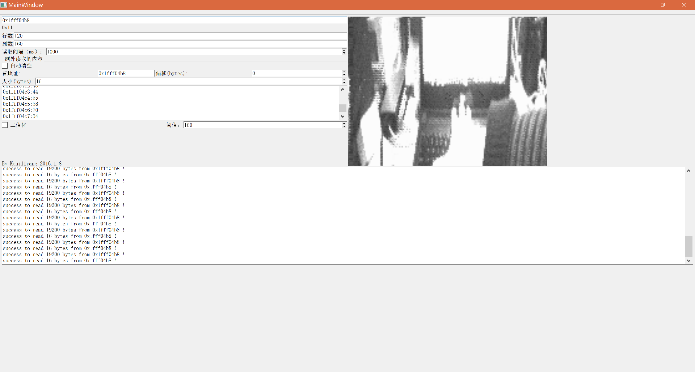
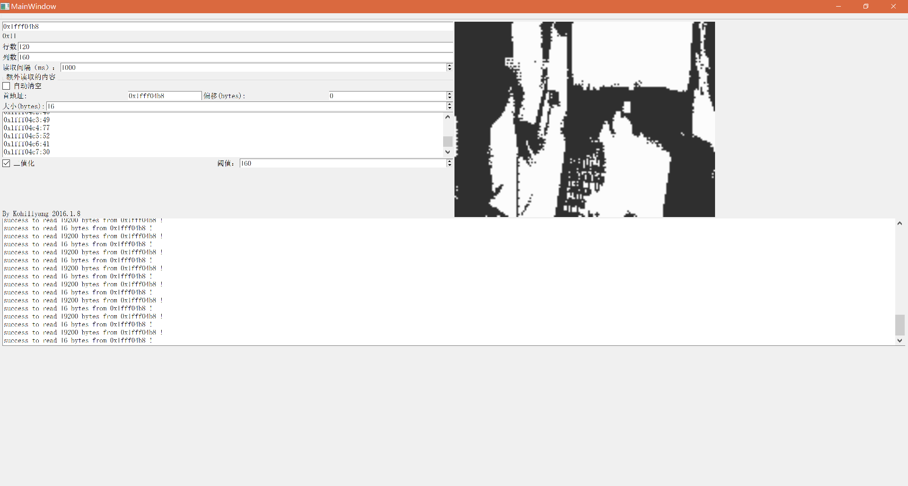
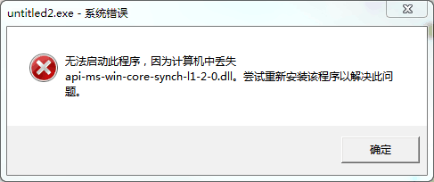
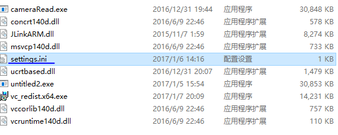
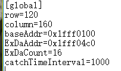
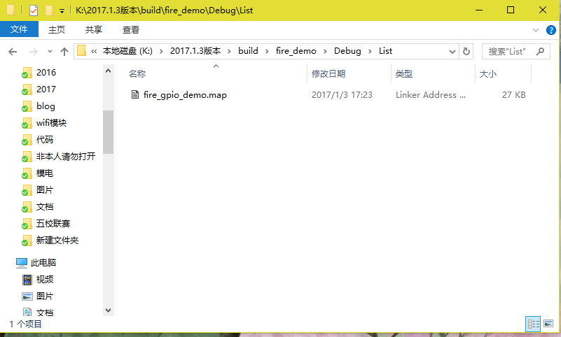
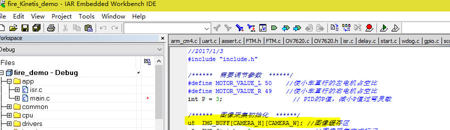
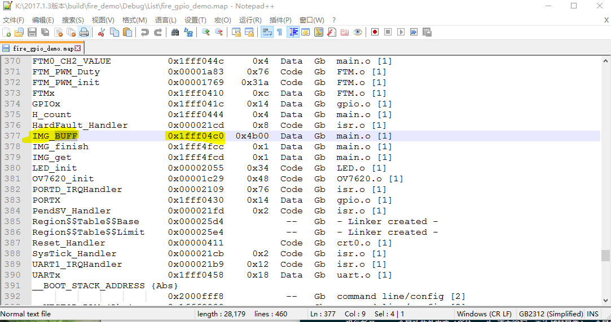
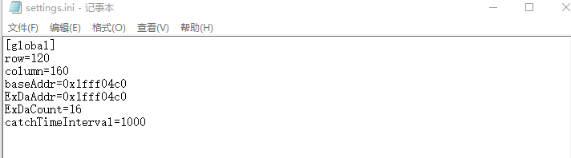

[点我从github上下载最新版本](https://github.com/kohillyang/smart-car-camera-read-by-jlink-and-qt/releases/tag/v0.3) 
[如果github上无法正常下载，点我从七牛CDN上下载所有版本](http://oj5adp5xv.bkt.clouddn.com/cameraRead.zip) 
**应广大人民群众的要求，本人于2017/1/9日发布alpha2版本，更新看截图** 
**下文中的文档针对上一版本编写，但是仍然适用** 
原图如下： 
 
二值化图像如下（阈值160，可在程序中调整）： 
 
*部分更新如下：* 
1. 自动缩放图像，对高分屏更友好 
2. 增加图像二值化选项，方便需要二值化的算法调整阈值 
3. 调大读取数据的最大上限（10000）,但本人建议不要太大，因为jlink 速度有限 
4. 增加偏移选项，实际读取的地址为基地址+偏移 
5. 修复部分bug 
***Note：参数保存是在程序退出之时，程序运行中拔出jlink会导致软件非正常退出，使输入的参数无法保存。*** 
 
 
 

##1. 软件简介
项目托管于https://github.com/kohillyang/smart-car-camera-read-by-jlink-and-qt, 该软件旨在方便使用jlink读取摄像头数据，最新版本支持自定义分辨率，自定义地址，自定义刷新间隔 
最新Release版本见：https://github.com/kohillyang/smart-car-camera-read-by-jlink-and-qt/releases/
软件截图如下： 

##2. 软件原理以及注意事项
原理很简单，电脑端将数据通过jlink读取到电脑的内存中，使用QPicture画到电脑。 
PS：由于本人能力有限，拿到的jlink API也有限，所以如果出现软件无法连接智能车主控的情况，请重新下一次程序。下程序的过程中会自动恢复jlink的大部分设置。 
K60可能出现被锁住无法下载的情况，请在jlink commander下输入unlock kinetis解决。 
**NOTE：摄像头为5V供电，jlink 输出电源为3.3V，单使用jlink会出现摄像头电压不足，因此连接摄像头时请接通主电源（电池）。** 
**NOTE：强行断开jlink会导致软件崩溃（所给api为C语言编写，无法捕获异常），会导致设置文件无法保存** 
如果出现类似下图所示的DLL丢失的情况，请安装Visual C++ Redistributable for Visual Studio 2015，下载链接：https://www.microsoft.com/en-us/download/confirmation.aspx?id=48145
 
如果出现下图中的窗口，请检查jlink是否正确连接 
 
##3. 使用方法
最新版本在程序**正常**退出的情况下会自动保存基地址，行数，列数等信息，第一次使用时，建议打开文件夹下的settings.ini，设置地址等信息，如下图所示： 
 
 
关键在于baseAddr的设置，可在工程目录/build/工程名/debug/lst/xxx.map中查看，建议直接在工程路径下找*.map 
比如，假设工程名为firedemo，则该文件的目录为： 
 
假设存储图片的数组名为IMG_BUFF，如下图所示 
 
此时在MAP文件中能找到IMG_BUFF的地址，如图： 
 
上图中左边是变量名，右边的地址0x1fff04c0填入上文中的settings.ini中的baseAddr即可,对于本例，最终更改的ini截图如下： 
 
如果是新摄像头，分辨率默认最大为160*120，否则为320*240。如果出现图像显示不正确的情况，请检查行和列是否正确填写 

